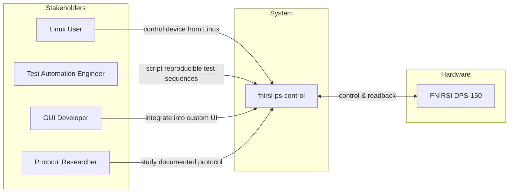
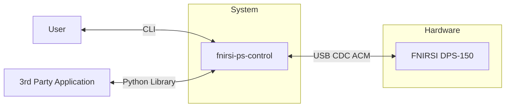

# 3. System Scope and Context

## Business Context

```mermaid
graph LR
    subgraph Stakeholders
        LU["Linux User"]
        TAE["Test Automation Engineer"]
        GD["GUI Developer"]
        PR["Protocol Researcher"]
    end

    subgraph System
        SYS["fnirsi-ps-control"]
    end

    subgraph Hardware
        DPS["FNIRSI DPS-150"]
    end

    LU -- "control device from Linux" --> SYS
    TAE -- "script reproducible test sequences" --> SYS
    GD -- "integrate into custom UI" --> SYS
    PR -- "study documented protocol" --> SYS
    SYS <-- "control & readback" --> DPS
```

## Technical Context

```mermaid
graph LR
    User["User"]
    App["3rd Party Application"]

    subgraph System
        SYS["fnirsi-ps-control"]
    end

    subgraph Hardware
        DPS["FNIRSI DPS-150"]
    end

    User -- "CLI" <--> SYS
    App -- "Python Library" <--> SYS
    SYS -- "USB CDC ACM" <--> DPS
```

