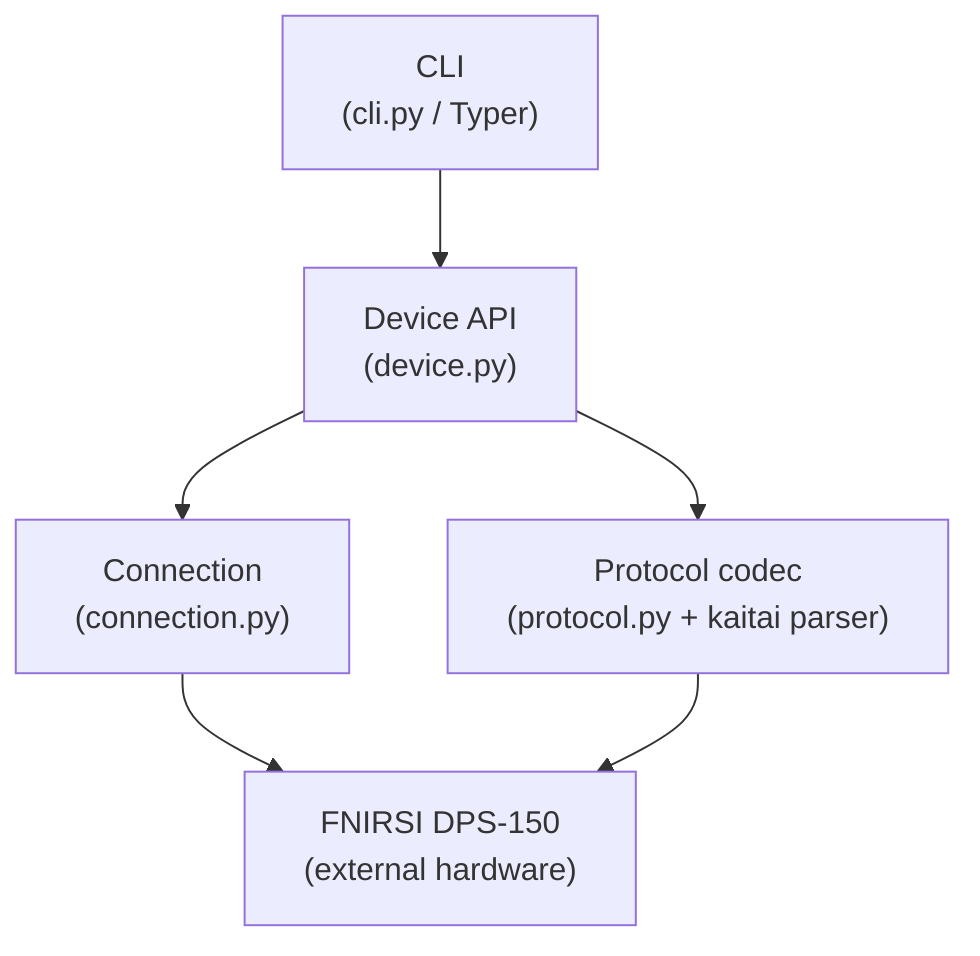

# 5. Building Block View

<!-- ARC42 §5: Show the static decomposition of the system into building blocks
     (modules, packages, components). Present at least Level 1. -->

## Level 1 — Overall System

_Diagram is a placeholder — verify module responsibilities and refine._

## Level 2 — Building Block Descriptions

<!-- For each top-level block, add a brief description:
     - Responsibility
     - Interfaces (public API / entry points)
     - Key dependencies -->

### CLI (`cli.py`)

_To be filled._

### Device API (`device.py`)

_To be filled._

### Connection (`connection.py`)

_To be filled._

### Protocol Codec (`protocol.py` + Kaitai parser)

_To be filled._
