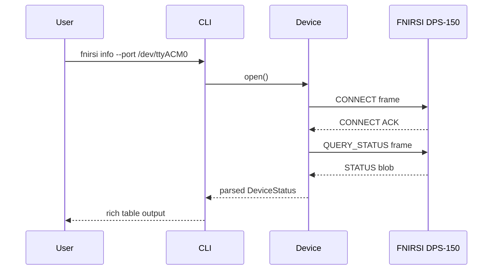

# 6. Runtime View

<!-- ARC42 §6: Illustrate the behaviour of important use cases / scenarios
     as interaction or sequence diagrams. -->

## Scenario 1: Connect and Query Device Info

_Placeholder — verify exact frame sequence and add error paths._

## Scenario 2: Set Voltage / Current

_To be filled. Add a sequence diagram similar to Scenario 1._

## Scenario 3: Output Enable / Disable

_To be filled._
