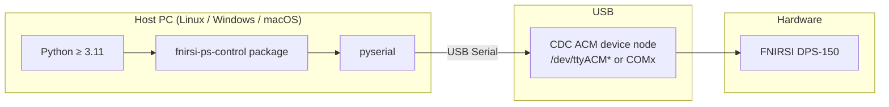

# 7. Deployment View

<!-- ARC42 §7: Describe the hardware and software environment the system runs in.
     Show how building blocks map onto infrastructure. -->

## Infrastructure Level 1

_Placeholder — add OS-specific notes and any CI/packaging deployment details._

## Deployment Notes

<!-- How is the package distributed? (PyPI, git clone, uv tool install, …)
     Are there any OS-level driver requirements? -->

_To be filled._
