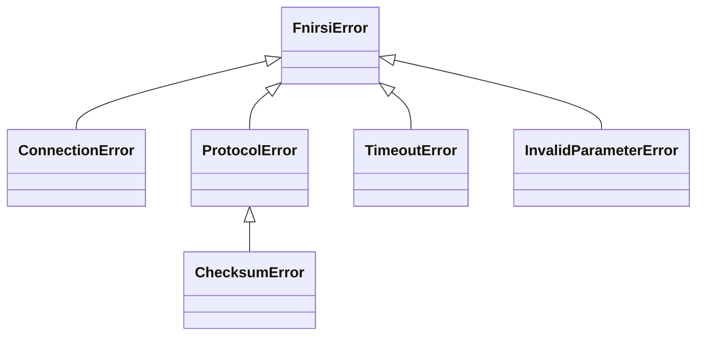

# Python API Reference

This page documents the public Python API of the `fnirsi-ps-control` library.

---

## Device Layer — `fnirsi_ps_control.device`

### `DPS150`

High-level interface to the FNIRSI DPS-150 power supply. Implements the
context manager protocol to handle connection/disconnection automatically.

```python
from fnirsi_ps_control.device import DPS150

with DPS150("/dev/ttyACM0") as ps:
    ps.set_voltage(12.0)
    ps.set_current_limit(1.0)
    ps.enable_output()
    status = ps.get_status()
```

#### Constructor

```python
DPS150(port: str, baudrate: int = 9600, timeout: float = 1.0)
```

| Parameter | Type | Default | Description |
|-----------|------|---------|-------------|
| `port` | `str` | — | Serial port path (e.g. `/dev/ttyACM0`, `COM3`) |
| `baudrate` | `int` | `9600` | Baud rate |
| `timeout` | `float` | `1.0` | Command response timeout in seconds |

#### Methods

| Method | Parameters | Returns | Description |
|--------|-----------|---------|-------------|
| `set_voltage(volts)` | `volts: float` | `None` | Set output voltage (0–30 V) |
| `set_current_limit(amps)` | `amps: float` | `None` | Set current limit (0–5.1 A) |
| `enable_output()` | — | `None` | Enable power output |
| `disable_output()` | — | `None` | Disable power output |
| `get_status()` | — | `DeviceStatus` | Query full device status |

#### Context Manager

- `__enter__` → opens port, sends CONNECT, polls GET_READY, sends START_SESSION magic
- `__exit__` → sends DISCONNECT, closes port

---

### `DeviceStatus`

Dataclass returned by `DPS150.get_status()`.

| Field | Type | Description |
|-------|------|-------------|
| `voltage_set_v` | `float` | Voltage set-point in volts |
| `current_set_a` | `float` | Current limit in amps |
| `output_enabled` | `bool` | Output state (⚠️ always `False` — offset TBD) |

| Property | Type | Description |
|----------|------|-------------|
| `power_w` | `float` | Estimated power (voltage × current) |

---

## Protocol Layer — `fnirsi_ps_control.protocol`

### Constants

| Constant | Value | Description |
|----------|-------|-------------|
| `DIR_TX` | `0xF1` | Direction prefix: host → device |
| `DIR_RX` | `0xF0` | Direction prefix: device → host |
| `START_QUERY` | `0xA1` | Start byte: read/query (also all responses) |
| `START_WRITE` | `0xB1` | Start byte: write/set command |
| `START_CTRL` | `0xC1` | Start byte: connect/disconnect control |
| `START_SESSION_MAGIC` | `b"\xb0\x00\x01\x01\x01"` | Opaque session init sequence |

### `Cmd` — Command IDs

| Attribute | Value | Description |
|-----------|-------|-------------|
| `CONNECT_CTRL` | `0x00` | Connect/disconnect control |
| `GET_READY` | `0xE1` | Query ready status |
| `GET_DEVICE_NAME` | `0xDE` | Query device name |
| `GET_HW_VERSION` | `0xE0` | Query hardware version |
| `GET_FW_VERSION` | `0xDF` | Query firmware version |
| `GET_FULL_STATUS` | `0xFF` | Query 139-byte status blob |
| `SET_VOLTAGE` | `0xC1` | Set output voltage |
| `SET_CURRENT` | `0xC2` | Set current limit |
| `SET_OUTPUT` | `0xDB` | Enable/disable output |
| `PUSH_OUTPUT` | `0xC3` | Periodic: Vout, Iout, Pout |
| `PUSH_VIN_A` | `0xC0` | Periodic: Vin channel A |
| `PUSH_VIN_B` | `0xE2` | Periodic: Vin channel B |
| `PUSH_MAX_I_REF` | `0xE3` | Periodic: max current (5.1 A) |
| `PUSH_VIN_C` | `0xC4` | Periodic: boost rail voltage |

### `Frame`

```python
@dataclass
class Frame:
    start: int
    cmd: int
    data: bytes = b""
```

| Method | Description |
|--------|-------------|
| `encode() → bytes` | Serialize to wire bytes (START + CMD + LEN + DATA + CHKSUM) |
| `Frame.decode(raw: bytes) → Frame` | Parse bytes into a Frame (classmethod) |

### TX Frame Builders

| Function | Returns | Wire Example |
|----------|---------|-------------|
| `encode_connect()` | `Frame` | `c1 00 01 01 02` |
| `encode_disconnect()` | `Frame` | `c1 00 01 00 01` |
| `encode_set_voltage(volts: float)` | `Frame` | `b1 c1 04 <f32> <chk>` |
| `encode_set_current(amps: float)` | `Frame` | `b1 c2 04 <f32> <chk>` |
| `encode_output_enable()` | `Frame` | `b1 db 01 01 dd` |
| `encode_output_disable()` | `Frame` | `b1 db 01 00 dc` |
| `encode_set_output(enabled: bool)` | `Frame` | Delegates to enable/disable |
| `encode_get_status()` | `Frame` | `a1 ff 01 00 00` |
| `encode_query(cmd: int)` | `Frame` | `a1 <cmd> 01 00 <chk>` |

### RX Payload Decoders

| Function | Input | Returns |
|----------|-------|---------|
| `decode_f32(data: bytes)` | 4 bytes | `float` |
| `decode_string(data: bytes)` | N bytes | `str` (ASCII) |
| `decode_push_output(data: bytes)` | 12 bytes | `tuple[float, float, float]` (Vout, Iout, Pout) |

---

## Connection Layer — `fnirsi_ps_control.connection`

### `SerialConnection`

Low-level serial wrapper. Handles the `0xf1`/`0xf0` direction prefix
transparently.

```python
SerialConnection(port: str, baudrate: int = 9600, timeout: float = 1.0)
```

| Method | Description |
|--------|-------------|
| `open()` | Open serial port (DTR=off, RTS=on) |
| `close()` | Close serial port |
| `write(data: bytes)` | Write data with `0xf1` TX prefix prepended |
| `read(n: int) → bytes` | Read exactly *n* bytes |
| `read_frame() → bytes` | Read one complete frame, strip `0xf0` DIR prefix |
| `flush()` | Flush input and output buffers |
| `is_open → bool` | Port open status |

!!! note "DIR byte handling"
    `write()` automatically prepends `0xf1` to every write.
    `read_frame()` automatically consumes and strips `0xf0` from reads.
    The application layer never sees direction bytes.

---

## Exceptions — `fnirsi_ps_control.exceptions`

All exceptions inherit from `FnirsiError`:



| Exception | When Raised |
|-----------|-------------|
| `ConnectionError` | Serial port cannot be opened or is lost |
| `ProtocolError` | Received frame violates expected protocol |
| `ChecksumError` | Frame checksum mismatch (subclass of `ProtocolError`) |
| `TimeoutError` | No response within configured timeout |
| `InvalidParameterError` | Parameter out of device range (e.g. voltage > 30 V) |
