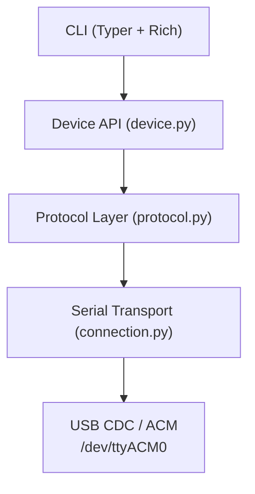

# FNIRSI DPS-150 Protocol Documentation

Welcome to the reverse-engineered protocol documentation for the **FNIRSI DPS-150**
regulated power supply (150 W, 30 V / 5.1 A).

!!! info "Status"
    Core protocol **CONFIRMED** against live hardware (2026-03-29).
    Values marked *TBD* are still working hypotheses.

Device details (USB IDs, serial config, baud rate) and the full wire format
are defined in the [Protocol Specification](protocol/spec.md).

---

## Architecture

The `fnirsi-ps-control` library is structured in four layers:



| Layer | Module | Responsibility |
|-------|--------|----------------|
| **CLI** | `fnirsi_ps_control.cli` | Command-line interface with Typer |
| **Device API** | `fnirsi_ps_control.device` | High-level `DPS150` class with context manager |
| **Protocol** | `fnirsi_ps_control.protocol` | Frame encode/decode, command IDs, checksums |
| **Transport** | `fnirsi_ps_control.connection` | Serial port I/O, DIR byte handling, frame reading |

---

## Quick Start

### Installation

```sh
git clone https://github.com/yourname/fnirsi_ps_control.git
cd fnirsi_ps_control
uv sync --extra dev
```

### CLI Usage

```sh
# Show help
uv run fnirsi --help

# Query device status
uv run fnirsi info --port /dev/ttyACM0

# Set voltage and current
uv run fnirsi set-voltage --port /dev/ttyACM0 12.0
uv run fnirsi set-current --port /dev/ttyACM0 1.0

# Enable / disable output
uv run fnirsi output --port /dev/ttyACM0 on
uv run fnirsi output --port /dev/ttyACM0 off
```

### Python API

```python
from fnirsi_ps_control.device import DPS150

with DPS150("/dev/ttyACM0") as ps:
    ps.set_voltage(12.0)     # volts
    ps.set_current_limit(1.0) # amps
    ps.enable_output()
    status = ps.get_status()
    print(f"{status.voltage_set_v} V, {status.current_set_a} A")
```

---

## Documentation Map

| Section | Contents |
|---------|----------|
| [Protocol Overview](protocol/README.md) | Device info, capture workflow, document index |
| [Protocol Specification](protocol/spec.md) | Wire format, commands, payloads — embeds the `.ksy` |
| [Session Lifecycle](protocol/session.md) | Connect → operate → disconnect sequence diagram |
| [Developer Setup](dev/setup.md) | Environment, tools, testing, CI |
| [RE Methodology](re_methodology.md) | How to capture and analyse new commands |
| [Python API Reference](dev/api.md) | Module-level API documentation |
