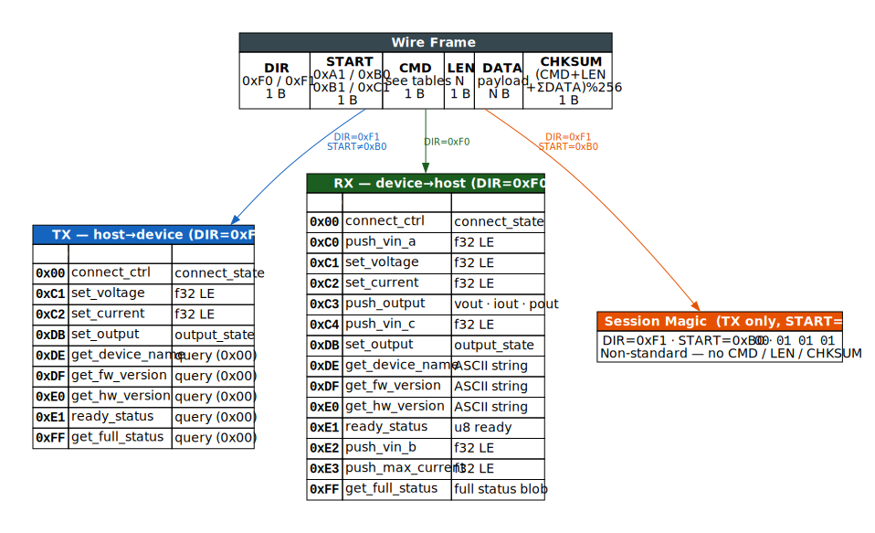

<!-- AUTO-GENERATED by scripts/ksy_to_md.py — do not edit manually -->

# Protocol Reference

Single source of truth: `protocol/fnirsi_dps150.ksy`

## Overview

| Property   | Value                          |
| ---------- | ------------------------------ |
| ID         | fnirsi_dps150                  |
| Title      | FNIRSI DPS-150 Serial Protocol |
| KS version | 0.11                           |
| Endian     | le                             |
| License    | MIT                            |

## Enumerations

### `direction`

| Value (hex) | Name           |
| ----------- | -------------- |
| `0xF0`      | device_to_host |
| `0xF1`      | host_to_device |

### `start_byte`

| Value (hex) | Name                |
| ----------- | ------------------- |
| `0xA1`      | query_or_response   |
| `0xB0`      | start_session_magic |
| `0xB1`      | write_command       |
| `0xC1`      | connect_ctrl        |

### `command_id`

| Value (hex) | Name             |
| ----------- | ---------------- |
| `0x00`      | connect_ctrl     |
| `0xC0`      | push_vin_a       |
| `0xC1`      | set_voltage      |
| `0xC2`      | set_current      |
| `0xC3`      | push_output      |
| `0xC4`      | push_vin_c       |
| `0xDB`      | set_output       |
| `0xDE`      | get_device_name  |
| `0xDF`      | get_fw_version   |
| `0xE0`      | get_hw_version   |
| `0xE1`      | ready_status     |
| `0xE2`      | push_vin_b       |
| `0xE3`      | push_max_current |
| `0xFF`      | get_full_status  |

### `connect_state`

| Value (hex) | Name       |
| ----------- | ---------- |
| `0x00`      | disconnect |
| `0x01`      | connect    |

### `output_state`

| Value (hex) | Name     |
| ----------- | -------- |
| `0x00`      | disabled |
| `0x01`      | enabled  |

## Command Catalogue

| Hex    | Name               | Payload type | Description |
| ------ | ------------------ | ------------ | ----------- |
| `0x00` | `connect_ctrl`     | `—`          |             |
| `0xC0` | `push_vin_a`       | `—`          |             |
| `0xC1` | `set_voltage`      | `—`          |             |
| `0xC2` | `set_current`      | `—`          |             |
| `0xC3` | `push_output`      | `—`          |             |
| `0xC4` | `push_vin_c`       | `—`          |             |
| `0xDB` | `set_output`       | `—`          |             |
| `0xDE` | `get_device_name`  | `—`          |             |
| `0xDF` | `get_fw_version`   | `—`          |             |
| `0xE0` | `get_hw_version`   | `—`          |             |
| `0xE1` | `ready_status`     | `—`          |             |
| `0xE2` | `push_vin_b`       | `—`          |             |
| `0xE3` | `push_max_current` | `—`          |             |
| `0xFF` | `get_full_status`  | `—`          |             |

## Payload Types

### `session_magic_body`

Non-standard 4-byte payload of the session-start magic frame (START=0xb0).

| Field   | Type | Description |
| ------- | ---- | ----------- |
| `magic` |      |             |

### `command_body`

Standard CMD/LEN/PAYLOAD/CHKSUM body used by all non-magic frames.

| Field      | Type                    | Description                                                                                                                                                                                                                                                                            |
| ---------- | ----------------------- | -------------------------------------------------------------------------------------------------------------------------------------------------------------------------------------------------------------------------------------------------------------------------------------- |
| `cmd`      | u8 (enum: `command_id`) | Command / register identifier.                                                                                                                                                                                                                                                         |
| `length`   | u8                      | Byte length of the payload field.                                                                                                                                                                                                                                                      |
| `payload`  | payload (switch)        | Payload interpretation depends on direction and command. TX queries (host→device) carry a single 0x00 placeholder byte (query_payload). TX writes carry the value to set (float32 or byte). RX responses carry the requested data. RX pushes are unsolicited device→host measurements. |
| `checksum` | u8                      | (CMD + LEN + Σ DATA bytes) mod 256. Confirmed by capture analysis.                                                                                                                                                                                                                     |

### `query_payload`

TX query frame payload (LEN=1, DATA=0x00).

| Field      | Type | Description  |
| ---------- | ---- | ------------ |
| `reserved` | u8   | Always 0x00. |

### `output_enable_payload`

Payload for CMD set_output (0xdb).

| Field   | Type                      | Description |
| ------- | ------------------------- | ----------- |
| `state` | u8 (enum: `output_state`) |             |

### `connect_payload`

Payload for CMD connect_ctrl (0x00).

| Field   | Type                       | Description |
| ------- | -------------------------- | ----------- |
| `state` | u8 (enum: `connect_state`) |             |

### `ready_payload`

RX payload for CMD ready_status (0xe1).

| Field   | Type | Description                            |
| ------- | ---- | -------------------------------------- |
| `ready` | u8   | 0x01 = device ready, 0x00 = not ready. |

### `string_payload`

RX payload for string response commands (device name, HW/FW version).

| Field   | Type         | Description |
| ------- | ------------ | ----------- |
| `value` | bytes (rest) |             |

### `float32_payload`

Single IEEE 754 32-bit LE float (voltage in V or current in A).

| Field   | Type   | Description |
| ------- | ------ | ----------- |
| `value` | f32 LE |             |

### `push_output_payload`

RX payload for CMD push_output (0xc3) — periodic measurement push (LEN=12).

| Field  | Type   | Description                                                                                             |
| ------ | ------ | ------------------------------------------------------------------------------------------------------- |
| `vout` | f32 LE | Measured output voltage [V].                                                                            |
| `iout` | f32 LE | Measured output current [A].                                                                            |
| `pout` | f32 LE | Measured output power [W]. Confirmed from capture row 12827: Vout≈8.45 V, Iout≈0.0077 A → Pout≈0.065 W. |

### `full_status_payload`

RX payload for CMD get_full_status (0xff) — full status blob (LEN=0x8b = 139 bytes).

| Field         | Type         | Description                                        |
| ------------- | ------------ | -------------------------------------------------- |
| `vin`         | f32 LE       | Measured input voltage [V].                        |
| `vset`        | f32 LE       | Current voltage set-point [V].                     |
| `iset`        | f32 LE       | Current current limit [A].                         |
| `vout`        | f32 LE       | Measured output voltage [V] (0 when output off).   |
| `iout`        | f32 LE       | Measured output current [A] (0 when output off).   |
| `pout`        | f32 LE       | Measured output power [W] (0 when output off).     |
| `vin2`        | f32 LE       | Secondary input voltage measurement [V] – TBD.     |
| `vset2`       | f32 LE       | Duplicate / channel-2 Vset – TBD.                  |
| `iset2`       | f32 LE       | Duplicate / channel-2 Iset – TBD.                  |
| `presets`     | preset ×5    | Five stored presets (Vset, Iset each).             |
| `max_voltage` | f32 LE       | Device maximum output voltage [V] (30.0).          |
| `max_current` | f32 LE       | Device maximum output current [A] (5.1).           |
| `max_power`   | f32 LE       | Device maximum output power [W] (150.0 = DPS-150). |
| `max_temp`    | f32 LE       | Maximum temperature [°C]? (80.0 – TBD).            |
| `unknown_f`   | f32 LE       | Unknown float at offset 92 – TBD.                  |
| `remainder`   | bytes (rest) | Mixed-type tail (offsets 96–138). Layout TBD.      |

### `preset`

One stored preset (Vset + Iset pair).

| Field  | Type   | Description                   |
| ------ | ------ | ----------------------------- |
| `vset` | f32 LE | Preset voltage set-point [V]. |
| `iset` | f32 LE | Preset current limit [A].     |

## Checksum

Every frame ends with a 1-byte checksum:

```
CHKSUM = (CMD + LEN + Σ DATA bytes) mod 256
```

The `DIR` and `START` bytes are **excluded** from the checksum calculation.
Confirmed by byte-exact comparison against captured frames.

## Structure Diagram


