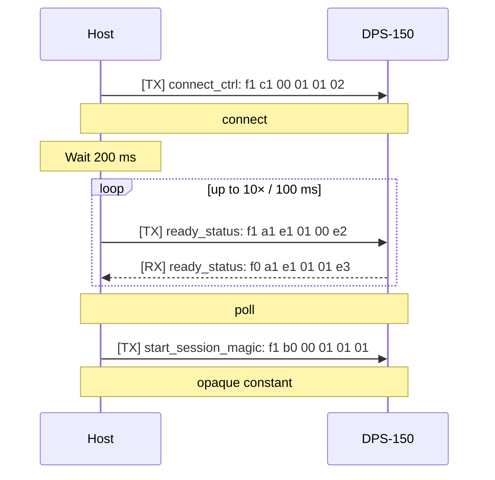
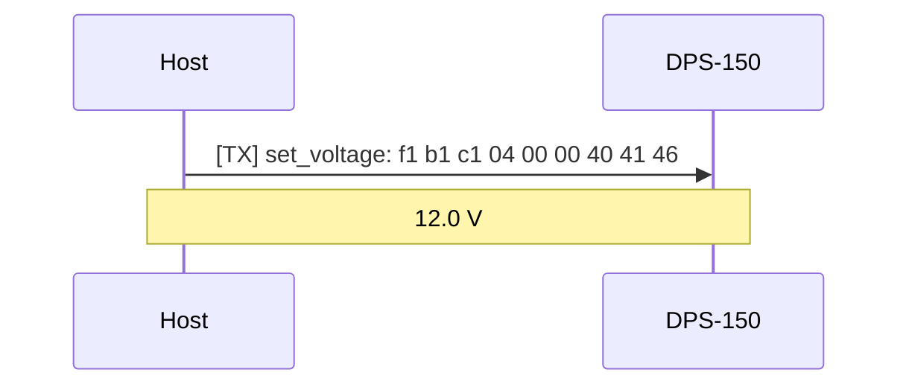
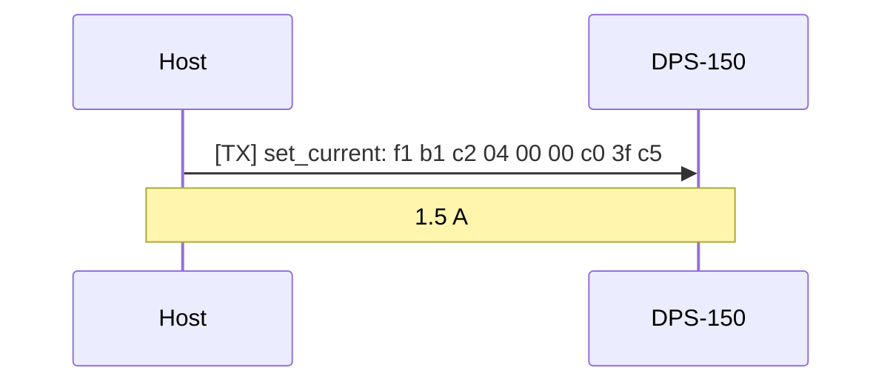
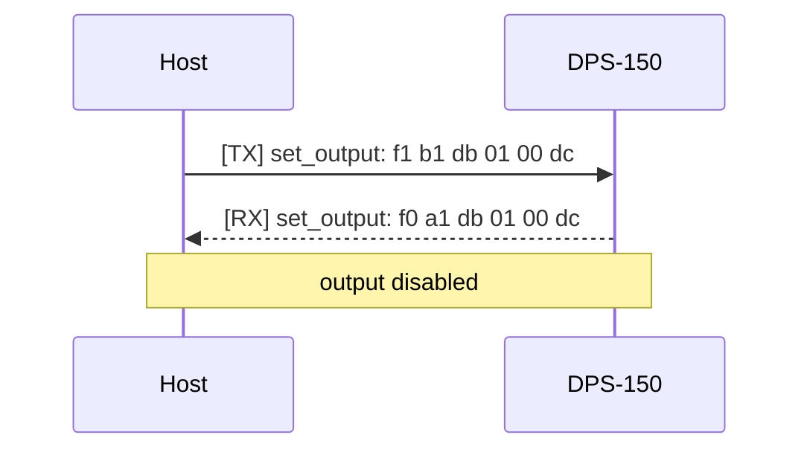
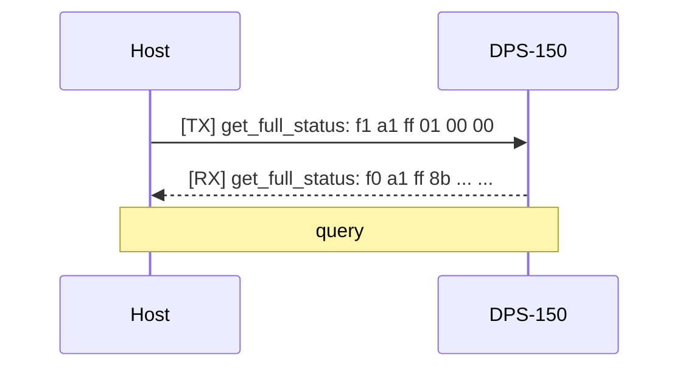
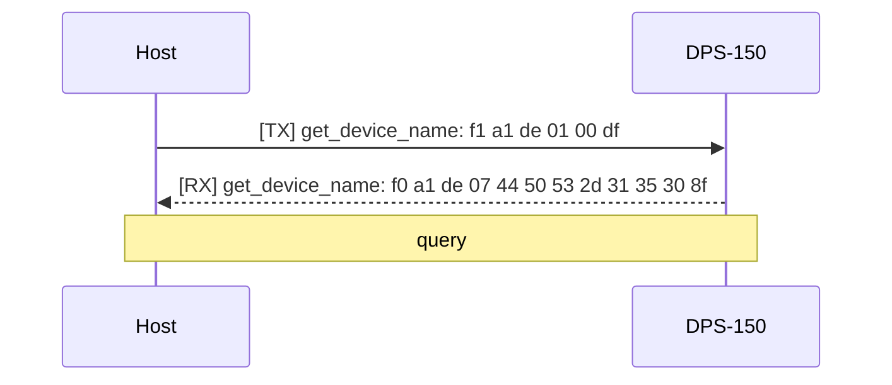
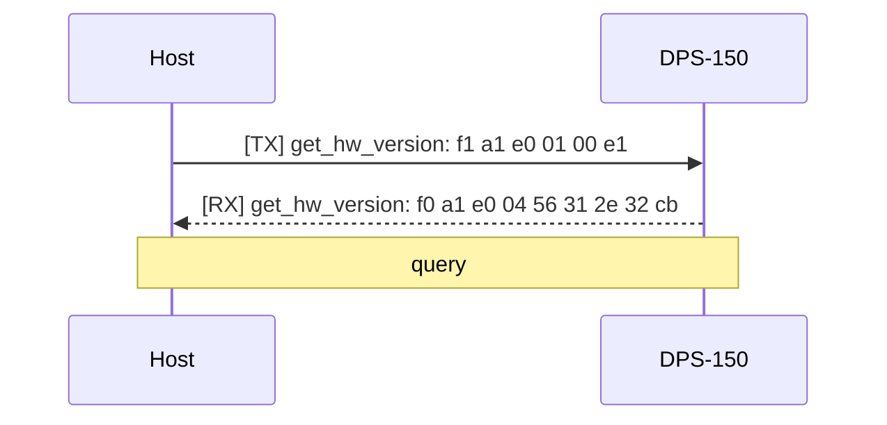
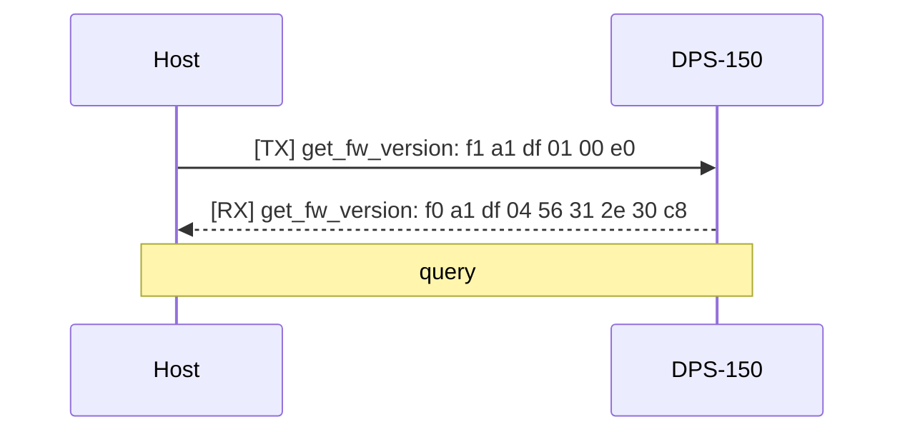
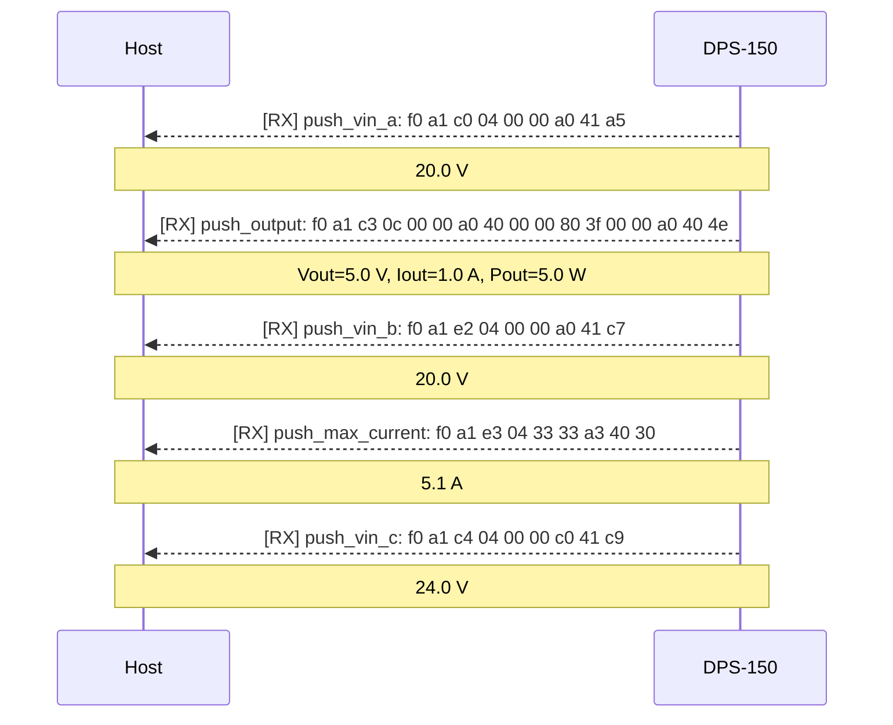
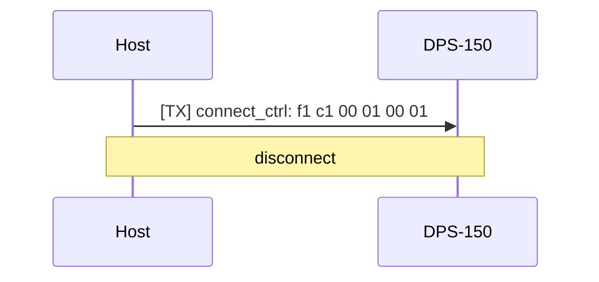

<!-- AUTO-GENERATED by scripts/ksy_to_md.py — do not edit manually -->

# Protocol Reference

Single source of truth: `protocol/fnirsi_dps150.ksy`

## Overview

| Property   | Value                          |
| ---------- | ------------------------------ |
| ID         | fnirsi_dps150                  |
| Title      | FNIRSI DPS-150 Serial Protocol |
| KS version | 0.11                           |
| Endian     | le                             |
| License    | MIT                            |

## Enumerations

### `start_byte`

| Value (hex) | Name                |
| ----------- | ------------------- |
| `0xA1`      | query_or_response   |
| `0xB0`      | start_session_magic |
| `0xB1`      | write_command       |
| `0xC1`      | connect_ctrl        |

### `command_id`

| Value (hex) | Name             |
| ----------- | ---------------- |
| `0x00`      | connect_ctrl     |
| `0xC0`      | push_vin_a       |
| `0xC1`      | set_voltage      |
| `0xC2`      | set_current      |
| `0xC3`      | push_output      |
| `0xC4`      | push_vin_c       |
| `0xDB`      | set_output       |
| `0xDE`      | get_device_name  |
| `0xDF`      | get_fw_version   |
| `0xE0`      | get_hw_version   |
| `0xE1`      | ready_status     |
| `0xE2`      | push_vin_b       |
| `0xE3`      | push_max_current |
| `0xFF`      | get_full_status  |

### `connect_state`

| Value (hex) | Name       |
| ----------- | ---------- |
| `0x00`      | disconnect |
| `0x01`      | connect    |

### `output_state`

| Value (hex) | Name     |
| ----------- | -------- |
| `0x00`      | disabled |
| `0x01`      | enabled  |

## Command Catalogue

| Hex    | Name               | Payload type            | Direction     | Response          | Description                                                |
| ------ | ------------------ | ----------------------- | ------------- | ----------------- | ---------------------------------------------------------- |
| `0x00` | `connect_ctrl`     | `connect_payload`       | host → device | —                 | Payload for CMD connect_ctrl (0x00). DATA = 0x01 → [...]   |
| `0xC0` | `push_vin_a`       | `float32_payload`       | device → host | unsolicited push  | Single IEEE 754 32-bit LE float (voltage in V or [...]     |
| `0xC1` | `set_voltage`      | `float32_payload`       | host → device | —                 | Single IEEE 754 32-bit LE float (voltage in V or [...]     |
| `0xC2` | `set_current`      | `float32_payload`       | host → device | —                 | Single IEEE 754 32-bit LE float (voltage in V or [...]     |
| `0xC3` | `push_output`      | `push_output_payload`   | device → host | unsolicited push  | CMD 0xc3 – periodic output measurement push (LEN=12, [...] |
| `0xC4` | `push_vin_c`       | `float32_payload`       | device → host | unsolicited push  | Single IEEE 754 32-bit LE float (voltage in V or [...]     |
| `0xDB` | `set_output`       | `output_enable_payload` | host → device | `set_output`      | Payload for CMD set_output (0xdb). DATA = 0x01 → [...]     |
| `0xDE` | `get_device_name`  | `string_payload`        | host → device | `get_device_name` | Variable-length ASCII string (no NUL terminator).          |
| `0xDF` | `get_fw_version`   | `string_payload`        | host → device | `get_fw_version`  | Variable-length ASCII string (no NUL terminator).          |
| `0xE0` | `get_hw_version`   | `string_payload`        | host → device | `get_hw_version`  | Variable-length ASCII string (no NUL terminator).          |
| `0xE1` | `ready_status`     | `ready_payload`         | both          | `ready_status`    | Device ready status (CMD 0xe1).                            |
| `0xE2` | `push_vin_b`       | `float32_payload`       | device → host | unsolicited push  | Single IEEE 754 32-bit LE float (voltage in V or [...]     |
| `0xE3` | `push_max_current` | `float32_payload`       | device → host | unsolicited push  | Single IEEE 754 32-bit LE float (voltage in V or [...]     |
| `0xFF` | `get_full_status`  | `full_status_payload`   | host → device | `get_full_status` | CMD 0xff – full status blob (LEN=0x8b = 139 bytes). [...]  |

## Command Sequences

!!! info "Source"
    Sequence data is defined in `protocol/sequences.yaml` and auto-generated here.
    For narrative context, timing diagrams, and wire-level examples
    see [Session Lifecycle](session.md).

### Connection Handshake

#### `connect_handshake`

Mandatory three-step handshake to establish a session.
Must complete before any active-session command is issued.



```
TX: f1 c1 00 01 01 02
    ├─ DIR   = 0xf1  (host → device)
    ├─ START = 0xc1  (connect_ctrl)
    ├─ CMD   = 0x00  (connect_ctrl)
    ├─ LEN   = 1
    ├─ DATA  = 01  →  connect
    └─ CHK   = 0x02  (= (0x00 + 1 + 0x01) mod 256)
```

```
TX: f1 a1 e1 01 00 e2
    ├─ DIR   = 0xf1  (host → device)
    ├─ START = 0xa1  (query_or_response)
    ├─ CMD   = 0xe1  (ready_status)
    ├─ LEN   = 1
    ├─ DATA  = 00  →  poll
    └─ CHK   = 0xe2  (= (0xe1 + 1 + 0x00) mod 256)
RX: f0 a1 e1 01 01 e3
    ├─ DIR   = 0xf0  (device → host)
    ├─ START = 0xa1  (query_or_response)
    ├─ CMD   = 0xe1  (ready_status)
    ├─ LEN   = 1
    ├─ DATA  = 01  →  ready = 1
    └─ CHK   = 0xe3  (= (0xe1 + 1 + 0x01) mod 256)
```

```
TX: f1 b0 00 01 01 01
    ├─ DIR   = 0xf1  (host → device)
    ├─ START = 0xb0  (start_session_magic)
    ├─ CMD   = 0x00  (connect_ctrl)
    ├─ LEN   = 1
    ├─ DATA  = 01  →  opaque constant
    └─ CHK   = 0x01  (non-standard — send as opaque constant)
```

| Step | Direction     | CMD                   | Payload / timing               | Response                    | Notes                                                                             |
| ---- | ------------- | --------------------- | ------------------------------ | --------------------------- | --------------------------------------------------------------------------------- |
| 1    | host → device | `connect_ctrl`        | data=0x01                      | —                           | Wake the device. No response expected.                                            |
| 2    | delay         | —                     | 200 ms                         | —                           | Allow device initialisation time before polling.                                  |
| 3    | host → device | `ready_status`        | data=0x00 (retry ×10 / 100 ms) | `ready_status` — ready == 1 | Poll until device signals ready. Retry up to 10× with 100 ms delay.               |
| 4    | host → device | `start_session_magic` | b0 00 01 01 01                 | —                           | Opaque 5-byte constant. START=0xb0, non-standard checksum. Send as literal bytes. |

### Active Session

#### `set_voltage`

Set the output voltage set-point. Fire-and-forget — no response.



```
TX: f1 b1 c1 04 00 00 40 41 46
    ├─ DIR   = 0xf1  (host → device)
    ├─ START = 0xb1  (write_command)
    ├─ CMD   = 0xc1  (set_voltage)
    ├─ LEN   = 4
    ├─ DATA  = 00 00 40 41  →  12.0 V
    └─ CHK   = 0x46  (= (0xc1 + 4 + 0x00 + 0x00 + 0x40 + 0x41) mod 256)
```

| Step | Direction     | CMD           | Payload / timing | Response | Notes |
| ---- | ------------- | ------------- | ---------------- | -------- | ----- |
| 1    | host → device | `set_voltage` | float32 [V]      | —        |       |

#### `set_current`

Set the current limit. Fire-and-forget — no response.



```
TX: f1 b1 c2 04 00 00 c0 3f c5
    ├─ DIR   = 0xf1  (host → device)
    ├─ START = 0xb1  (write_command)
    ├─ CMD   = 0xc2  (set_current)
    ├─ LEN   = 4
    ├─ DATA  = 00 00 c0 3f  →  1.5 A
    └─ CHK   = 0xc5  (= (0xc2 + 4 + 0x00 + 0x00 + 0xc0 + 0x3f) mod 256)
```

| Step | Direction     | CMD           | Payload / timing | Response | Notes |
| ---- | ------------- | ------------- | ---------------- | -------- | ----- |
| 1    | host → device | `set_current` | float32 [A]      | —        |       |

#### `set_output_enable`

Enable the power output.
The device echoes the full frame back with START=0xa1.
This is the only write command that elicits a response.


```
TX: f1 b1 db 01 01 dd
    ├─ DIR   = 0xf1  (host → device)
    ├─ START = 0xb1  (write_command)
    ├─ CMD   = 0xdb  (set_output)
    ├─ LEN   = 1
    ├─ DATA  = 01  →  output enabled
    └─ CHK   = 0xdd  (= (0xdb + 1 + 0x01) mod 256)
RX: f0 a1 db 01 01 dd
    ├─ DIR   = 0xf0  (device → host)
    ├─ START = 0xa1  (query_or_response)
    ├─ CMD   = 0xdb  (set_output)
    ├─ LEN   = 1
    ├─ DATA  = 01  →  echo — DATA=0x01 (enabled)
    └─ CHK   = 0xdd  (= (0xdb + 1 + 0x01) mod 256)
```

| Step | Direction     | CMD          | Payload / timing | Response                               | Notes                                     |
| ---- | ------------- | ------------ | ---------------- | -------------------------------------- | ----------------------------------------- |
| 1    | host → device | `set_output` | data=0x01        | `set_output` — same payload as request | Echo uses START=0xa1 (query_or_response). |

#### `set_output_disable`

Disable the power output.
The device echoes the full frame back with START=0xa1.



```
TX: f1 b1 db 01 00 dc
    ├─ DIR   = 0xf1  (host → device)
    ├─ START = 0xb1  (write_command)
    ├─ CMD   = 0xdb  (set_output)
    ├─ LEN   = 1
    ├─ DATA  = 00  →  output disabled
    └─ CHK   = 0xdc  (= (0xdb + 1 + 0x00) mod 256)
RX: f0 a1 db 01 00 dc
    ├─ DIR   = 0xf0  (device → host)
    ├─ START = 0xa1  (query_or_response)
    ├─ CMD   = 0xdb  (set_output)
    ├─ LEN   = 1
    ├─ DATA  = 00  →  echo — DATA=0x00 (disabled)
    └─ CHK   = 0xdc  (= (0xdb + 1 + 0x00) mod 256)
```

| Step | Direction     | CMD          | Payload / timing | Response                               | Notes                                     |
| ---- | ------------- | ------------ | ---------------- | -------------------------------------- | ----------------------------------------- |
| 1    | host → device | `set_output` | data=0x00        | `set_output` — same payload as request | Echo uses START=0xa1 (query_or_response). |

#### `get_full_status`

Query the complete device state blob (139 bytes).



```
TX: f1 a1 ff 01 00 00
    ├─ DIR   = 0xf1  (host → device)
    ├─ START = 0xa1  (query_or_response)
    ├─ CMD   = 0xff  (get_full_status)
    ├─ LEN   = 1
    ├─ DATA  = 00  →  query
    └─ CHK   = 0x00  (= (0xff + 1 + 0x00) mod 256)
RX: f0 a1 ff 8b ...  (truncated — 139-byte status blob)
```

| Step | Direction     | CMD               | Payload / timing | Response          | Notes                                                     |
| ---- | ------------- | ----------------- | ---------------- | ----------------- | --------------------------------------------------------- |
| 1    | host → device | `get_full_status` | data=0x00        | `get_full_status` | Response may be interleaved with unsolicited push frames. |

#### `get_device_name`

Query device name. Response is an ASCII string.



```
TX: f1 a1 de 01 00 df
    ├─ DIR   = 0xf1  (host → device)
    ├─ START = 0xa1  (query_or_response)
    ├─ CMD   = 0xde  (get_device_name)
    ├─ LEN   = 1
    ├─ DATA  = 00  →  query
    └─ CHK   = 0xdf  (= (0xde + 1 + 0x00) mod 256)
RX: f0 a1 de 07 44 50 53 2d 31 35 30 8f
    ├─ DIR   = 0xf0  (device → host)
    ├─ START = 0xa1  (query_or_response)
    ├─ CMD   = 0xde  (get_device_name)
    ├─ LEN   = 7
    ├─ DATA  = 44 50 53 2d 31 35 30  →  "DPS-150" (7 ASCII bytes)
    └─ CHK   = 0x8f  (= (0xde + 7 + 0x44 + 0x50 + 0x53 + 0x2d + 0x31 + 0x35 + 0x30) mod 256)
```

| Step | Direction     | CMD               | Payload / timing | Response          | Notes |
| ---- | ------------- | ----------------- | ---------------- | ----------------- | ----- |
| 1    | host → device | `get_device_name` | data=0x00        | `get_device_name` |       |

#### `get_hw_version`

Query hardware version. Response is an ASCII string.



```
TX: f1 a1 e0 01 00 e1
    ├─ DIR   = 0xf1  (host → device)
    ├─ START = 0xa1  (query_or_response)
    ├─ CMD   = 0xe0  (get_hw_version)
    ├─ LEN   = 1
    ├─ DATA  = 00  →  query
    └─ CHK   = 0xe1  (= (0xe0 + 1 + 0x00) mod 256)
RX: f0 a1 e0 04 56 31 2e 32 cb
    ├─ DIR   = 0xf0  (device → host)
    ├─ START = 0xa1  (query_or_response)
    ├─ CMD   = 0xe0  (get_hw_version)
    ├─ LEN   = 4
    ├─ DATA  = 56 31 2e 32  →  "V1.2" (4 ASCII bytes)
    └─ CHK   = 0xcb  (= (0xe0 + 4 + 0x56 + 0x31 + 0x2e + 0x32) mod 256)
```

| Step | Direction     | CMD              | Payload / timing | Response         | Notes |
| ---- | ------------- | ---------------- | ---------------- | ---------------- | ----- |
| 1    | host → device | `get_hw_version` | data=0x00        | `get_hw_version` |       |

#### `get_fw_version`

Query firmware version. Response is an ASCII string.



```
TX: f1 a1 df 01 00 e0
    ├─ DIR   = 0xf1  (host → device)
    ├─ START = 0xa1  (query_or_response)
    ├─ CMD   = 0xdf  (get_fw_version)
    ├─ LEN   = 1
    ├─ DATA  = 00  →  query
    └─ CHK   = 0xe0  (= (0xdf + 1 + 0x00) mod 256)
RX: f0 a1 df 04 56 31 2e 30 c8
    ├─ DIR   = 0xf0  (device → host)
    ├─ START = 0xa1  (query_or_response)
    ├─ CMD   = 0xdf  (get_fw_version)
    ├─ LEN   = 4
    ├─ DATA  = 56 31 2e 30  →  "V1.0" (4 ASCII bytes)
    └─ CHK   = 0xc8  (= (0xdf + 4 + 0x56 + 0x31 + 0x2e + 0x30) mod 256)
```

| Step | Direction     | CMD              | Payload / timing | Response         | Notes |
| ---- | ------------- | ---------------- | ---------------- | ---------------- | ----- |
| 1    | host → device | `get_fw_version` | data=0x00        | `get_fw_version` |       |

#### `push_stream`

Unsolicited periodic data push from device to host, approximately every
600 ms. No request frame is needed; the device emits these automatically
once the connect handshake completes.



```
RX: f0 a1 c0 04 00 00 a0 41 a5
    ├─ DIR   = 0xf0  (device → host)
    ├─ START = 0xa1  (query_or_response)
    ├─ CMD   = 0xc0  (push_vin_a)
    ├─ LEN   = 4
    ├─ DATA  = 00 00 a0 41  →  20.0 V
    └─ CHK   = 0xa5  (= (0xc0 + 4 + 0x00 + 0x00 + 0xa0 + 0x41) mod 256)
```

```
RX: f0 a1 c3 0c 00 00 a0 40 00 00 80 3f 00 00 a0 40 4e
    ├─ DIR   = 0xf0  (device → host)
    ├─ START = 0xa1  (query_or_response)
    ├─ CMD   = 0xc3  (push_output)
    ├─ LEN   = 12
    ├─ DATA  = 00 00 a0 40 00 00 80 3f 00 00 a0 40  →  Vout=5.0 V, Iout=1.0 A, Pout=5.0 W
    └─ CHK   = 0x4e  (= (0xc3 + 12 + 0x00 + 0x00 + 0xa0 + 0x40 + 0x00 + 0x00 + 0x80 + 0x3f + 0x00 + 0x00 + 0xa0 + 0x40) mod 256)
```

```
RX: f0 a1 e2 04 00 00 a0 41 c7
    ├─ DIR   = 0xf0  (device → host)
    ├─ START = 0xa1  (query_or_response)
    ├─ CMD   = 0xe2  (push_vin_b)
    ├─ LEN   = 4
    ├─ DATA  = 00 00 a0 41  →  20.0 V
    └─ CHK   = 0xc7  (= (0xe2 + 4 + 0x00 + 0x00 + 0xa0 + 0x41) mod 256)
```

```
RX: f0 a1 e3 04 33 33 a3 40 30
    ├─ DIR   = 0xf0  (device → host)
    ├─ START = 0xa1  (query_or_response)
    ├─ CMD   = 0xe3  (push_max_current)
    ├─ LEN   = 4
    ├─ DATA  = 33 33 a3 40  →  5.1 A
    └─ CHK   = 0x30  (= (0xe3 + 4 + 0x33 + 0x33 + 0xa3 + 0x40) mod 256)
```

```
RX: f0 a1 c4 04 00 00 c0 41 c9
    ├─ DIR   = 0xf0  (device → host)
    ├─ START = 0xa1  (query_or_response)
    ├─ CMD   = 0xc4  (push_vin_c)
    ├─ LEN   = 4
    ├─ DATA  = 00 00 c0 41  →  24.0 V
    └─ CHK   = 0xc9  (= (0xc4 + 4 + 0x00 + 0x00 + 0xc0 + 0x41) mod 256)
```

| Step | Direction     | CMD                | Payload / timing | Response | Notes                                    |
| ---- | ------------- | ------------------ | ---------------- | -------- | ---------------------------------------- |
| 1    | device → host | `push_vin_a`       | — (~600 ms)      | —        | Input voltage channel A [V].             |
| 2    | device → host | `push_output`      | — (~600 ms)      | —        | Vout [V], Iout [A], Pout [W].            |
| 3    | device → host | `push_vin_b`       | — (~600 ms)      | —        | Alternate input voltage measurement [V]. |
| 4    | device → host | `push_max_current` | — (~600 ms)      | —        | Device maximum current constant (5.1 A). |
| 5    | device → host | `push_vin_c`       | — (~600 ms)      | —        | Boost rail voltage [V].                  |

### Disconnection

#### `disconnect`

Terminate the session. No response expected. Close the serial port after sending.



```
TX: f1 c1 00 01 00 01
    ├─ DIR   = 0xf1  (host → device)
    ├─ START = 0xc1  (connect_ctrl)
    ├─ CMD   = 0x00  (connect_ctrl)
    ├─ LEN   = 1
    ├─ DATA  = 00  →  disconnect
    └─ CHK   = 0x01  (= (0x00 + 1 + 0x00) mod 256)
```

| Step | Direction     | CMD            | Payload / timing | Response | Notes                                    |
| ---- | ------------- | -------------- | ---------------- | -------- | ---------------------------------------- |
| 1    | host → device | `connect_ctrl` | data=0x00        | —        | Mirror of connect step 1 with data=0x00. |

## Payload Types

### `output_enable_payload`

Payload for CMD set_output (0xdb).

| Field   | Type                      | Description |
| ------- | ------------------------- | ----------- |
| `state` | u8 (enum: `output_state`) |             |

### `connect_payload`

Payload for CMD connect_ctrl (0x00).

| Field   | Type                       | Description |
| ------- | -------------------------- | ----------- |
| `state` | u8 (enum: `connect_state`) |             |

### `ready_payload`

Device ready status (CMD 0xe1).

| Field   | Type | Description                            |
| ------- | ---- | -------------------------------------- |
| `ready` | u8   | 0x01 = device ready, 0x00 = not ready. |

### `string_payload`

Variable-length ASCII string (no NUL terminator).

| Field   | Type         | Description |
| ------- | ------------ | ----------- |
| `value` | bytes (rest) |             |

### `float32_payload`

Single IEEE 754 32-bit LE float (voltage in V or current in A).

| Field   | Type   | Description |
| ------- | ------ | ----------- |
| `value` | f32 LE |             |

### `push_output_payload`

CMD 0xc3 – periodic output measurement push (LEN=12, three floats).

| Field  | Type   | Description                                                                                             |
| ------ | ------ | ------------------------------------------------------------------------------------------------------- |
| `vout` | f32 LE | Measured output voltage [V].                                                                            |
| `iout` | f32 LE | Measured output current [A].                                                                            |
| `pout` | f32 LE | Measured output power [W]. Confirmed from capture row 12827: Vout≈8.45 V, Iout≈0.0077 A → Pout≈0.065 W. |

### `full_status_payload`

CMD 0xff – full status blob (LEN=0x8b = 139 bytes).

| Field         | Type         | Description                                        |
| ------------- | ------------ | -------------------------------------------------- |
| `vin`         | f32 LE       | Measured input voltage [V].                        |
| `vset`        | f32 LE       | Current voltage set-point [V].                     |
| `iset`        | f32 LE       | Current current limit [A].                         |
| `vout`        | f32 LE       | Measured output voltage [V] (0 when output off).   |
| `iout`        | f32 LE       | Measured output current [A] (0 when output off).   |
| `pout`        | f32 LE       | Measured output power [W] (0 when output off).     |
| `vin2`        | f32 LE       | Secondary input voltage measurement [V] – TBD.     |
| `vset2`       | f32 LE       | Duplicate / channel-2 Vset – TBD.                  |
| `iset2`       | f32 LE       | Duplicate / channel-2 Iset – TBD.                  |
| `presets`     | preset ×5    | Five stored presets (Vset, Iset each).             |
| `max_voltage` | f32 LE       | Device maximum output voltage [V] (30.0).          |
| `max_current` | f32 LE       | Device maximum output current [A] (5.1).           |
| `max_power`   | f32 LE       | Device maximum output power [W] (150.0 = DPS-150). |
| `max_temp`    | f32 LE       | Maximum temperature [°C]? (80.0 – TBD).            |
| `unknown_f`   | f32 LE       | Unknown float at offset 92 – TBD.                  |
| `remainder`   | bytes (rest) | Mixed-type tail (offsets 96–138). Layout TBD.      |

### `preset`

One stored preset (Vset + Iset pair).

| Field  | Type   | Description                   |
| ------ | ------ | ----------------------------- |
| `vset` | f32 LE | Preset voltage set-point [V]. |
| `iset` | f32 LE | Preset current limit [A].     |

## Checksum

Every frame ends with a 1-byte checksum:

```
CHKSUM = (CMD + LEN + Σ DATA bytes) mod 256
```

The `DIR` and `START` bytes are **excluded** from the checksum calculation.
Confirmed by byte-exact comparison against captured frames.
