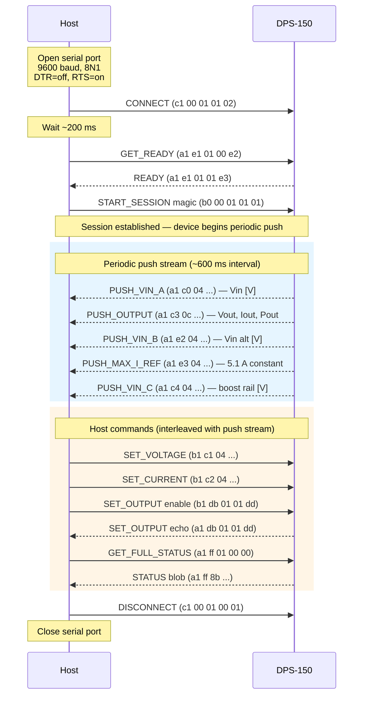

# Session Lifecycle

This document describes the complete communication sequence between the host
and the FNIRSI DPS-150 power supply, from connection establishment through
operation to disconnection.

!!! info "Source"
    All sequences confirmed from captures
    `dps150_connect_set_10v_set_1A_disconnect.txt` and
    `dps150_connect_enable_out_set_v_set_i_disable_disconnect.txt` (2026-03-29).

---

## Connection Sequence



---

## Phase 1: Connection Handshake

The handshake consists of three mandatory steps:

### Step 1 — CONNECT

The host sends a CONNECT control frame to wake the device:

```
TX: f1  c1 00 01 01 02
        │  │  │  │  └── CHKSUM = (00+01+01) mod 256 = 0x02
        │  │  │  └───── DATA = 0x01 (connect)
        │  │  └──────── LEN = 1
        │  └─────────── CMD = 0x00 (CONNECT_CTRL)
        └────────────── START = 0xc1 (control)
```

### Step 2 — Poll GET_READY

The host polls the ready status. The device may take a few hundred milliseconds
to become ready:

```
TX: f1  a1 e1 01 00 e2       (query GET_READY, DATA=0x00)
RX: f0  a1 e1 01 01 e3       (response: ready=1)
```

If `ready ≠ 1`, the host retries up to 10 times with 100 ms delays.

### Step 3 — Start-Session Magic

An opaque 5-byte sequence sent by the manufacturer tool in every session:

```
TX: f1  b0 00 01 01 01
```

!!! warning "Non-standard checksum"
    This frame uses START byte `0xb0` and its checksum does **not** follow the
    standard `(CMD + LEN + Σ DATA) mod 256` algorithm. Expected `0x02`, actual
    `0x01`. Treated as an opaque constant.

---

## Phase 2: Active Session

Once the session is established, two independent data flows run concurrently:

### Periodic Push Stream (Device → Host)

The device pushes measurement data approximately every **600 ms**, unsolicited:

| CMD | Name | Payload | Description |
|-----|------|---------|-------------|
| `0xc0` | `PUSH_VIN_A` | 1 × float32 | Input voltage channel A (~20.1 V) |
| `0xc3` | `PUSH_OUTPUT` | 3 × float32 | Vout [V], Iout [A], Pout [W] |
| `0xe2` | `PUSH_VIN_B` | 1 × float32 | Alternate Vin measurement (~19.9 V) |
| `0xe3` | `PUSH_MAX_I_REF` | 1 × float32 | Max current constant (5.1 A) |
| `0xc4` | `PUSH_VIN_C` | 1 × float32 | Boost rail voltage (~23.6 V) |

All push frames use START byte `0xa1`.

### Host Commands (Host → Device)

Commands can be sent at any time during an active session:

| Action | START | CMD | Payload | Response |
|--------|-------|-----|---------|----------|
| Set voltage | `0xb1` | `0xc1` | float32 [V] | None (fire-and-forget) |
| Set current | `0xb1` | `0xc2` | float32 [A] | None (fire-and-forget) |
| Enable output | `0xb1` | `0xdb` | `0x01` | Echo with START=`0xa1` |
| Disable output | `0xb1` | `0xdb` | `0x00` | Echo with START=`0xa1` |
| Query status | `0xa1` | `0xff` | `0x00` | 139-byte status blob |

!!! note "Interleaving"
    The host must be prepared to receive periodic push frames between
    sending a command and receiving its response. The `read_frame()` method
    reads one complete length-delimited frame at a time to handle this.

---

## Phase 3: Disconnection

The host sends a DISCONNECT control frame:

```
TX: f1  c1 00 01 00 01
        │  │  │  │  └── CHKSUM = (00+01+00) mod 256 = 0x01
        │  │  │  └───── DATA = 0x00 (disconnect)
        │  │  └──────── LEN = 1
        │  └─────────── CMD = 0x00 (CONNECT_CTRL)
        └────────────── START = 0xc1 (control)
```

After disconnect, the serial port is closed. No response is expected.

---

## Timing Diagram

```mermaid
gantt
    title Session Timeline
    dateFormat X
    axisFormat %s

    section Handshake
    CONNECT frame           :a1, 0, 1
    GET_READY poll          :a2, 2, 3
    START_SESSION magic     :a3, 3, 4

    section Push Stream
    PUSH_VIN_A              :b1, 5, 6
    PUSH_OUTPUT             :b2, 5, 6
    PUSH_VIN_B              :b3, 5, 6
    PUSH_VIN_A              :b4, 11, 12
    PUSH_OUTPUT             :b5, 11, 12

    section Host Commands
    SET_VOLTAGE 12.0V       :c1, 7, 8
    SET_CURRENT 1.0A        :c2, 8, 9
    SET_OUTPUT enable       :c3, 9, 10

    section Teardown
    DISCONNECT              :d1, 15, 16
```



---

## Python Implementation

The `DPS150` class implements this lifecycle as a context manager:

```python
from fnirsi_ps_control.device import DPS150

# __enter__ performs Phase 1 (CONNECT + GET_READY + START_SESSION)
with DPS150("/dev/ttyACM0") as ps:
    # Phase 2: active session
    ps.set_voltage(12.0)
    ps.set_current_limit(1.0)
    ps.enable_output()
    status = ps.get_status()
# __exit__ performs Phase 3 (DISCONNECT + close port)
```
